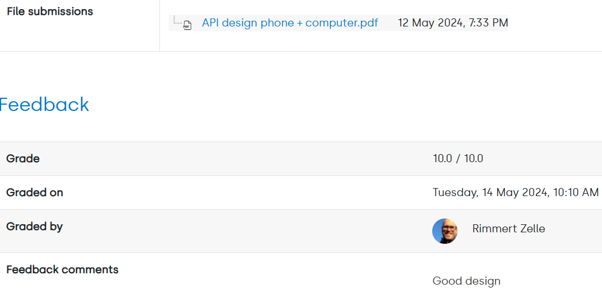

## Authors
**Alexandra Smirnova** - [lexa24lexa](https://github.com/lexa24lexa)

## Hosted link
[stitch api live in github pages](https://lexa24lexa.github.io/stitch-api/)

## Github repo
[stitch api repo](https://github.com/lexa24lexa/stitch-api-itdp)

## Updated version 2nd year attempt
**Design**

Last year feedback:
10/10, "Good design".

**HTML** 
Last year feedback:
0 points, "A bit too many divs used. And you are misusing nav in a nav. Also I don't think you need that many structural elements. For example in your header.".

- I tried to fix this the best way i could, in every page.

**CSS lay-out**
Last year feedback:
4 points.

**CSS Mobile first**
Last year feedback:
0 points, "No breakpoints or tailwinds' mobile prefixes used".

- It works in mobile, tablet and desktop.
- Tailwind implemented (after very big struggle :) )

**AJAX request**
Last year feedback:
20 points.

**Concurrent AJAX request**
Last year feedback:
0 points, "No concurrent requests used.".

- I implemented this in the js folder, stitch.js file at the end.

## Running the project in VSC
npm install -- node_modules
